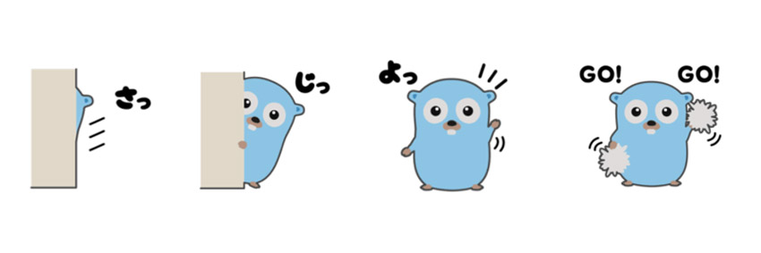

# Go语言学习记录

## Go LeetCode(TODO)

## Golang实现的爬虫

[内容来自这里](https://coding.imooc.com/class/180.html)

### 单任务版爬虫(single_task_crawler)
- 架构

### 并发版爬虫(crawler)
- frontend部分并没有做好
- 架构    

### 分布式版爬虫(crawler_distributed)
- 需要依赖并发版爬虫的代码
- 架构
