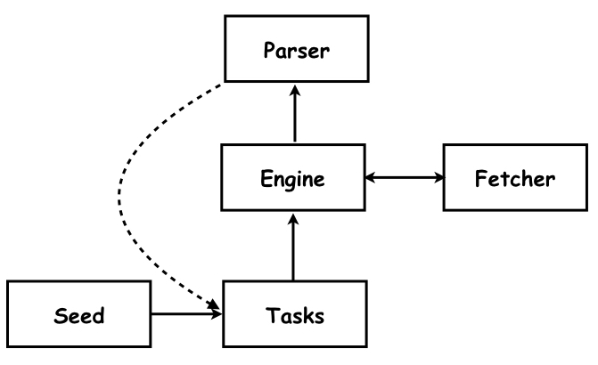

# Go语言学习记录

## Go LeetCode

### [tree](./goleetcode/tree)


## Golang实现的爬虫

[学习内容来自这里](https://coding.imooc.com/class/180.html)

### [Ⅰ. 单任务版爬虫](./single_task_crawler)
#### 架构：单任务结构



- seed: URL种子集合
- Tasks: 任务队列，存储ParseResult，其中包含URL，items和解析对应URL content的函数
- Engine: 遍历任务队列驱动整个爬虫运作。将URL传递给Fetcher获取页面，调用ParserFunc解析对应页面
- Parser: 解析页面生成ParserResult存入Tasks队列
- Fetcher: 获取URL对应的页面
- ~~Saver~~: 暂无存储直接在控制台输出item

### [Ⅱ. 并发版爬虫](./crawler)
#### frontend部分并没有做好(TODO)
#### 架构1: 

在单任务版爬虫上做了改进。增加了存储，并把fetcher和parser抽象为worker，每一个worker都会起一个goroutine，从而实现并发。在当前架构中所有包含worker的goroutine统一使用一个全局的传入、传出channel。


- Saver: 使用Elastic Search做数据库。起goroutine通过channel接收数据并实现对数据的插入操作
- Scheduler: 增加调度器模块通过channel管理worker的数据接收
- 缺陷: 如果爬虫解析速度偏慢，会导致主循环部分无法读取out，in也无法写入，最终导致爬虫无法获取in中内容而陷入循环deadlock
``` go
    
    // engine 主循环部分代码片段
    for {
        result := <-out // out是worker的传出channel
        for r := range(result.Requests)
            in<-r   // in是worker的传入channel
        }
    }

    // worker接收request部分,这部分代码包含在一个goroutine里
    request := <-in
    out<-Worker(request)    //调用Worker函数

```


#### 架构2：

在架构1上简单改进解除deadlock。


- 通过新起goroutine阻塞等待写入worker的接收channel来解除deadlock

```go
    // engine 主循环部分代码片段
    for {
        result := <-out // out是worker的传出channel
        for r := range(result.Requests)
            go func(){  // [!]修改部分
                in<-r   // in是worker的传入channel
            }()
        }
    }

    // worker接收request部分,这部分代码包含在一个goroutine里
    request := <-in
    out<-Worker(request)    //调用Worker函数
```


#### 架构3：
给爬虫加速，增加request队列和worker的输入channel队列。


- 在engine中使用map数据结构进行查重
- Request Queue: 存储解析出来的request结构（包含url和Parser接口，其中又包含序列化函数和解析函数）
- Worker Queue：存储对应每个Worker的接收channel


### [Ⅲ. 分布式版爬虫](./crawler_distributed)

#### 架构：
把原先所有的channel修改为RPC（通过jsonrpc实现）。


- Worker Server: 可以运行在其他主机上，提供解析URL和爬取页面的服务
- Work Client: 存在于Worker goroutine中，通实它现RPC
- Saver Server: 可以运行在其他主机上，提供存储服务
- Saver Client: 存在于存储goroutine，调用它实现远程调用
- Pool of worker clients: 循环向各个爬虫分发pool中存在的worker client handle
- 序列化和反序列化
- 函数名的解析

- 缺陷
    - 查重机制不够完善
    - worker server挂了之后，重启无法重新利用，需要重启整个engine部分。


